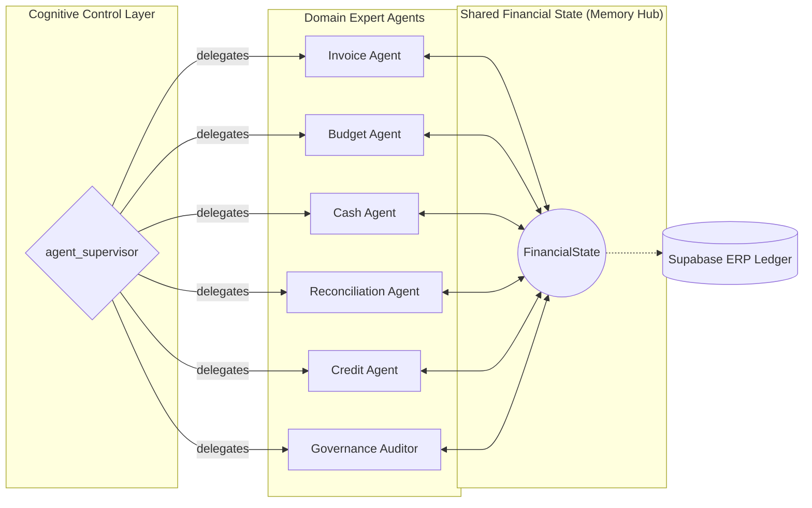
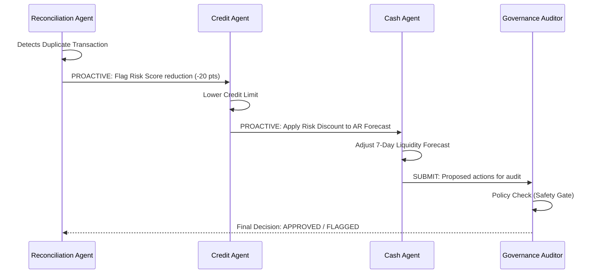

<div align="center">
  

  # ⭐ FAgentLLM
  **Six Agents, One Vision: Smarter Finance, Better Decisions.**
</div>

[](https://www.python.org/)
[](https://fastapi.tiangolo.com/)
[](https://reactjs.org/)
[](https://www.langchain.com/langchain)

*A unified multi-agent LLM architecture that overcomes fragmented enterprise finance operations through autonomous orchestration, causal reasoning, and explainable decision-making.*


---

## 📖 Project Overview

**FAgentLLM** is an advanced, multi-agent financial intelligence system designed to replicate and automate the complex, cross-domain decision-making processes of a corporate finance department. 

Instead of relying on rigid, rule-based ERP systems or isolated AI chat interfaces, FAgentLLM deploys **six specialized autonomous agents** (Invoice, Budget, Cash, Reconciliation, Credit, and Governance) that communicate, validate, and causally influence each other's decisions in real-time.

### ❓ Why this project exists (The Problem)
Enterprise finance teams suffer from massive operational silos. Accounts Payable doesn't dynamically talk to Treasury, and Credit Risk doesn't instantly react to Reconciliation anomalies. This fragmentation causes delayed reporting, missed liquidity risks, and manual data-entry bottlenecks. 

### 💡 The Solution
FAgentLLM solves this by acting as a **Cognitive Intelligence Layer** over traditional ERP data. When an anomaly occurs in reconciliation, the system autonomously traces the causal chain—instantly recalculating credit risk and adjusting near-term liquidity forecasts—with full Explainable AI (XAI) transparency.

---

## ✨ Key Features

- **🤖 6-Agent Ecosystem**: Specialized agents orchestrating Invoice, Budget, Cash, Reconciliation, Credit, and **Governance** operations.
- **🛡️ Governance Auditor**: A dedicated safety gate agent that reviews all cross-agent decisions against corporate policy and financial guardrails before final execution.
- **📄 3-Layer Resilient OCR Pipeline**: Cascading document ingestion via PyMuPDF (Native) → Baidu Qianfan (Cloud) → Tesseract (Local fallback).
- **🔗 Causal Domain Reasoning**: The XAI engine dynamically links agent decisions. An anomaly in reconciliation autonomously triggers a credit risk reassessment and adjusts AR liquidity forecasts.
- **🔍 Hybrid Vector Reconciliation**: 4-stage pipeline — Episodic Patterns → TF-IDF (≥0.50) → PGVector MiniLM-L6 semantic search (≥0.68) → FX variance (≤2%). Bank-side embeddings are pre-computed automatically on each run; `scripts/warm_vectors.py` backfills the full history using the same canonical `tx_to_string` encoder as the agent, ensuring zero encoding drift.
- **🧠 Persistent Agent Memory**: Agents utilize a four-layer memory system — **episodic** (past decision outcomes), **temporal** (utilisation snapshots), **semantic** (LLM-derived anomaly patterns), and **procedural** (policy rules & formula weights applied per run) — enabling consistency enforcement and drift detection across pipeline executions.
- **📊 Forensic Audit Tracing**: A beautiful React frontend that visualizes the exact technical, business, and causal reasoning behind every single autonomous decision.
- **🤝 Stakeholder Collaboration Portal**: A manual dispute resolution system allowing stakeholders to resolve anomalies, force matches, or escalate disputes to external audit.
- **🛡️ Deterministic Financial Guardrails**: LLMs are used strictly for cognitive routing and qualitative analysis, while math, budgets, and similarities are enforced via hard deterministic formulas.
- **🔄 Groq API Key Rotation**: High-availability LLM orchestration that round-robins across multiple Groq API keys to multiply TPM/RPM limits and prevent 429 rate-limit errors under sustained load.
- **📈 Evaluation & Metrics Dashboard**: Live performance tracking (F1-score, Precision, Recall) and confusion matrices for each agent. Metrics are computed from live Supabase data using a proxy definition (extraction confidence ≥ 85% = predicted positive), reflecting real operational signals rather than held-out ground-truth labels.
- **⚡ V4.2 Performance Tuning**: Optimized for Groq free-tier stability with 100-item batch windows and 0.68 semantic matching sensitivity.

---

## 🛠️ Tech Stack

### Backend / AI Orchestration
- **Python 3.11+**
- **FastAPI** (High-performance API routing)
- **LangGraph** (Stateful multi-agent orchestration)
- **Qwen3-32B** (Primary Reasoning & Reflection tier)
- **Llama-3.1-8b-instant** (High-speed Workhorse tier for routine extraction)
- **Baidu CoBuddy (free)** (Fallback resilience model via OpenRouter)
- **MiniLM-L6** (Local vector embeddings via `sentence-transformers`)
- **Baidu Qianfan / Tesseract** (OCR pipeline)

### Frontend / UI
- **React 18 + Vite**
- **TypeScript**
- **Vanilla CSS** (Glassmorphism & modern design tokens)

### Database
- **Supabase (PostgreSQL + pgvector)** (Real-time state, causal links, and vector embeddings)

---

## 🚀 Installation & Setup

### 1. Clone the repository
```bash
git clone https://github.com/maysamsgx/fagenllm_2026_Semmmrr.git
cd fagenllm_2026_Semmmrr
```

### 2. Set up the Python backend
```bash
python -m venv venv
source venv/bin/activate  # On Windows: venv\Scripts\activate
pip install -r requirements.txt
```

### 3. Set up environment variables
Create a `.env` file in the root directory (see `.env.example`):
```env
# Database (Supabase)
SUPABASE_URL="your_supabase_url"
SUPABASE_SERVICE_KEY="your_service_role_key"

# LLM Providers
GROQ_API_KEY="your_groq_key"
OPENROUTER_API_KEY="your_openrouter_key"
```

### 4. Run the Application
Start the FastAPI backend:
```bash
uvicorn main:app --reload --port 8000
```
Start the Vite frontend (in a new terminal):
```bash
npm install
npm run dev
```

### 5. Warm vector embeddings (first run only)
Before triggering reconciliation for the first time, backfill MiniLM embeddings for all existing transactions so the semantic search stage has full coverage:
```bash
python -m scripts.warm_vectors
```
After this, the reconciliation agent automatically computes embeddings for any new transactions it encounters, so this script only needs to be run once per database seed.

---

## 📁 Repository Structure

The codebase is organized according to the **DOE Framework** — each top-level directory maps directly to one of the three architectural layers. This makes it immediately clear *where* any given piece of logic belongs and *why* it lives there.

```
semmmrr/
│
├── 📂 directive/                    # ◈ DIRECTIVE LAYER — Policy, Rules & Prompts
│   ├── policies.py                  #   Deterministic Python constants (weights, thresholds)
│   ├── directives.py                #   Policy injection engine (loads .md → LLM system prompt)
│   ├── prompts.py                   #   All structured LLM prompt templates (per agent)
│   ├── budget_policy.md             #   Natural language policy: budget guardrails
│   ├── cash_policy.md               #   Natural language policy: liquidity rules
│   ├── credit_policy.md             #   Natural language policy: credit scoring rules
│   ├── governance_policy.md         #   Natural language policy: audit & compliance gates
│   ├── invoice_policy.md            #   Natural language policy: invoice validation rules
│   └── reconciliation_policy.md     #   Natural language policy: reconciliation thresholds
│
├── 📂 orchestration/                # ◈ ORCHESTRATION LAYER — Routing & Agent Coordination
│   ├── agent_modules.py             #   Formal 6-module architecture (Perception→Explanation)
│   ├── 📂 agents/                   #   Domain-expert agent logic (LangGraph nodes)
│   │   ├── state.py                 #     FinancialState TypedDict — the shared memory hub
│   │   ├── graph.py                 #     LangGraph state machine wiring & node registration
│   │   ├── supervisor.py            #     Macro-router: decides which agent runs next
│   │   ├── invoice_agent.py         #     Invoice extraction, validation & fraud detection
│   │   ├── budget_agent.py          #     Budget variance analysis & policy enforcement
│   │   ├── cash_agent.py            #     Liquidity forecasting & AR cash flow projection
│   │   ├── reconciliation_agent.py  #     4-stage hybrid reconciliation & anomaly detection
│   │   ├── credit_agent.py          #     Forensic credit risk scoring & collection staging
│   │   └── governance_agent.py      #     Compliance audit gate — reviews all agent actions
│   └── 📂 routers/                  #   FastAPI route handlers (HTTP → agent workflows)
│       ├── invoice.py
│       ├── budget.py
│       ├── cash.py
│       ├── credit.py
│       ├── reconciliation.py
│       ├── governance.py
│       ├── analytics.py
│       └── departments.py
│
├── 📂 execution/                    # ◈ EXECUTION LAYER — Side-Effects, DB & LLM Calls
│   ├── llm.py                       #   LLM client: Groq key rotation, failover, reflection
│   └── 📂 db/
│       └── supabase_client.py       #   All DB I/O: select, insert, update, causal logging
│
├── 📂 utils/                        # Shared cross-cutting utilities (auth, contracts, etc.)
│   ├── contracts.py                 #   Pydantic output schemas (DecisionOutput, etc.)
│   ├── auth.py                      #   API key authentication middleware
│   ├── security.py                  #   Request security helpers
│   ├── bootstrap.py                 #   App startup checks & initialization
│   └── maintenance.py              #   Scheduled maintenance helpers
│
├── 📂 evaluation/                   # 16-case held-out scientific evaluation suite
├── 📂 tests/                        # Unit & integration tests
├── 📂 scripts/                      # One-off operational scripts (seed, warm vectors, etc.)
├── 📂 data/                         # Static reference data & CSVs
├── 📂 components/                   # React UI components
├── 📂 public/                       # Static frontend assets
│
├── main.py                          # FastAPI application entry point
├── config.py                        # Centralised settings (env vars, API keys)
├── schema.sql                       # Full Supabase PostgreSQL schema
├── requirements.txt                 # Python dependencies
└── package.json                     # Node/React dependencies
```

> **Design Principle:** No code in `orchestration/` directly writes to the database. No code in `directive/` calls the LLM. No code in `execution/` contains routing or agent logic. This strict separation is what makes the system auditable, testable, and safe for autonomous financial operations.

---

## 🏗️ System Architecture

FAgentLLM is built on a **Supervisor-led Multi-Agent Orchestration** model using **LangGraph**. The architecture emphasizes modularity, shared state consistency, and causal explainability.

### 1. The Multi-Agent Cognitive Graph
The system operates as a **Stateful Agentic Hub**. Control is managed by the **Supervisor (Router)**, but communication is handled through the **Shared Financial State**. This prevents tight coupling and allows for asynchronous "Stigmergic" coordination.



### 2. The FinancialState (Shared Memory)
The `FinancialState` is the single source of truth. Instead of agents passing messages to each other (which is brittle), they mutate the **Shared State Hub**. 
*   **The Workflow:** An agent reads the current state, performs its specialized logic (LLM reasoning + Deterministic Math), and writes its findings back to the Hub. 
*   **Causal Linkage:** When the state is updated, it triggers the next node in the LangGraph, creating a chain of autonomous reasoning.

### 3. Causal Reasoning Engine
The most innovative part of the architecture is the **Causal Linkage System**. When the Reconciliation Agent detects an anomaly, it doesn't just log it; it proactively creates a `causal_link` to the Credit Agent, forcing a risk-score reduction.



### 4. Deterministic Guardrails
To prevent "LLM Hallucinations" in financial contexts, the system employs a **Hybrid Execution Model**:
*   **LLM (Qwen3):** Handles qualitative reasoning, semantic interpretation, and complex decision-routing.
*   **Math Engine:** All budget subtractions, cash-flow totals, and risk score calculations are enforced via **Hard Python Logic**, ensuring 100% mathematical integrity.

### 5. The DOE Framework (Directive, Orchestration, Execution)
FAgentLLM strictly adheres to the **DOE Framework**, a three-layer software architecture designed to constrain AI outputs and ensure enterprise-grade business reliability. This separation of concerns guarantees that LLMs handle complex reasoning, while strict policies and execution protocols remain deterministic.

*   **Directive Layer (The "What" & "Why"):** Houses business rules, guardrails, and natural language policies (e.g., `credit_policy.md`) injected into prompts, along with their deterministic Python formula counterparts.
*   **Orchestration Layer (The "How" & "Thinking"):** The cognitive engine powered by LangGraph. It maps the 6-module agent architecture (Perception, Reasoning, Decision, Communication), coordinating state and workflows between domain agents without directly mutating external systems.
*   **Execution Layer (The "Action" & "Memory"):** Handles all real-world side effects, tool calls, API integrations, and database modifications. This isolation ensures the reasoning layer never accidentally mutates financial data, executing and logging all actions with strict causal tracking.

---

## 🔮 Future Improvements / Roadmap

- [ ] **Asynchronous Event Bus**: Migrate from sequential LangGraph routing to an asynchronous pub/sub model (e.g., Kafka) for true parallel execution.
- [ ] **Enhanced RAG Coverage**: Expand vector search to include vendor/customer semantic profiling for better risk assessment.
- [ ] **External Integration**: Hook the Credit Agent's escalation logic into Twilio/SendGrid APIs for real automated collection notices.

---

<div align="center">
  
  <p>Built for the future of Autonomous Enterprise Finance.</p>
  <br />
  <h2>Alhamdulillah</h2>
</div>
