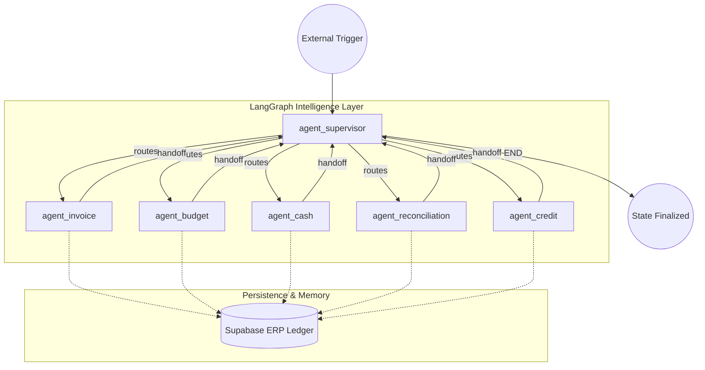
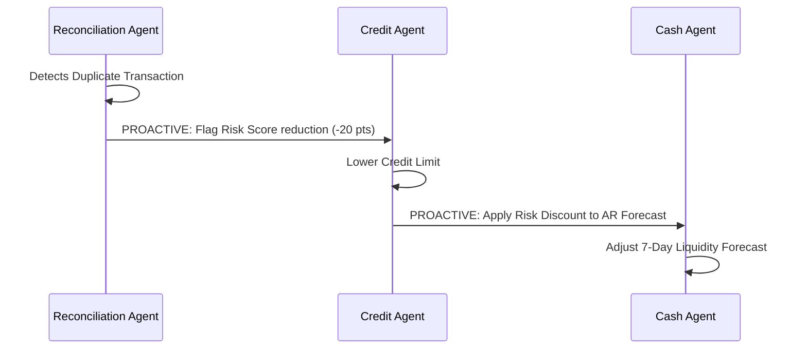

# 🌌 FAgentLLM
**Five Agents, One Vision: Smarter Finance, Better Decisions.**

[](https://www.python.org/)
[](https://fastapi.tiangolo.com/)
[](https://reactjs.org/)
[](https://www.langchain.com/langgraph)

*A unified multi-agent LLM architecture that overcomes fragmented enterprise finance operations through autonomous orchestration, causal reasoning, and explainable decision-making.*


---

## 📖 Project Overview

**FAgentLLM** is an advanced, multi-agent financial intelligence system designed to replicate and automate the complex, cross-domain decision-making processes of a corporate finance department. 

Instead of relying on rigid, rule-based ERP systems or isolated AI chat interfaces, FAgentLLM deploys **five specialized autonomous agents** (Invoice, Budget, Cash, Reconciliation, and Credit) that communicate, validate, and causally influence each other's decisions in real-time.

### ❓ Why this project exists (The Problem)
Enterprise finance teams suffer from massive operational silos. Accounts Payable doesn't dynamically talk to Treasury, and Credit Risk doesn't instantly react to Reconciliation anomalies. This fragmentation causes delayed reporting, missed liquidity risks, and manual data-entry bottlenecks. 

### 💡 The Solution
FAgentLLM solves this by acting as a **Cognitive Intelligence Layer** over traditional ERP data. When an anomaly occurs in reconciliation, the system autonomously traces the causal chain—instantly recalculating credit risk and adjusting near-term liquidity forecasts—with full Explainable AI (XAI) transparency.

---

## ✨ Key Features

- **🤖 5-Agent Ecosystem**: Specialized agents orchestrating Invoice, Budget, Cash, Reconciliation, and Credit operations.
- **📄 3-Layer Resilient OCR Pipeline**: Cascading document ingestion via PyMuPDF (Native) → Baidu Qianfan (Cloud) → Tesseract (Local fallback).
- **🔗 Causal Domain Reasoning**: The XAI engine dynamically links agent decisions. An anomaly in reconciliation autonomously triggers a credit risk reassessment and adjusts AR liquidity forecasts.
- **🛡️ Deterministic Financial Guardrails**: LLMs are used strictly for cognitive routing and qualitative analysis, while math, budgets, and similarities are enforced via hard deterministic formulas.
- **📊 Forensic Audit Tracing**: A beautiful React frontend that visualizes the exact technical, business, and causal reasoning behind every single autonomous decision.

---

## 🛠️ Tech Stack

### Backend / AI Orchestration
- **Python 3.11+**
- **FastAPI** (High-performance API routing)
- **LangGraph** (Stateful multi-agent orchestration)
- **Qwen3-32B** (Primary reasoning LLM via Groq)
- **Baidu Qianfan / Tesseract** (OCR pipeline)

### Frontend / UI
- **React 18 + Vite**
- **TypeScript**
- **Vanilla CSS** (Glassmorphism & modern design tokens)

### Database
- **Supabase (PostgreSQL)** (Real-time state and causal link storage)

---

## 🚀 Installation & Setup

### 1. Clone the repository
```bash
git https://github.com/maysamsgx/fagenllm_2026_Semmmrr
cd FAgentLLM
```

### 2. Set up the Python backend
```bash
python -m venv venv
source venv/bin/activate  # On Windows: venv\Scripts\activate
pip install -r requirements.txt
```

### 3. Set up environment variables
Create a `.env` file in the root directory (see `.env.example`):
```env
# Database
SUPABASE_URL="your_supabase_url"
SUPABASE_KEY="your_supabase_key"

# LLM Providers
GROQ_API_KEY="your_groq_key"
OPENROUTER_API_KEY="your_openrouter_key"
```

### 4. Run the Application
Start the FastAPI backend:
```bash
uvicorn main:app --reload --port 8000
```
Start the Vite frontend (in a new terminal):
```bash
npm install
npm run dev
```

---

## 🏗️ System Architecture

FAgentLLM is built on a **Supervisor-led Multi-Agent Orchestration** model using **LangGraph**. The architecture emphasizes modularity, shared state consistency, and causal explainability.

### 1. The Multi-Agent Cognitive Graph
The system operates as a stateful graph where each node is a specialized agent. The **Supervisor (Cognitive Router)** manages the lifecycle of a request, delegating tasks to domain experts based on the real-time financial state.



### 2. The FinancialState (Shared Memory)
Every agent operates on a shared **FinancialState** object (Stigmergy coordination). When one agent identifies a risk or executes a transaction, the modification is immediately visible to the next agent in the sequence.

*   **Shared Attributes:** `total_cash`, `budget_utilisation`, `system_risk_score`, `causal_summary`.
*   **Agentic Memory:** Agents append their `technical_explanation` and `business_explanation` to the state, allowing the next agent to understand the "context" of previous actions.

### 3. Causal Reasoning Engine
The most innovative part of the architecture is the **Causal Linkage System**. When the Reconciliation Agent detects an anomaly, it doesn't just log it; it proactively creates a `causal_link` to the Credit Agent, forcing a risk-score reduction.



### 4. Deterministic Guardrails
To prevent "LLM Hallucinations" in financial contexts, the system employs a **Hybrid Execution Model**:
*   **LLM (Qwen3):** Handles qualitative reasoning, semantic interpretation, and complex decision-routing.
*   **Math Engine:** All budget subtractions, cash-flow totals, and risk score calculations are enforced via **Hard Python Logic**, ensuring 100% mathematical integrity.

---

## 🔮 Future Improvements / Roadmap

- [ ] **Asynchronous Event Bus**: Migrate from sequential LangGraph routing to an asynchronous pub/sub model (e.g., Kafka) for true parallel execution.
- [ ] **Vector Embeddings (RAG)**: Replace the current TF-IDF / textual matching with SBERT embeddings stored in `pgvector` for enhanced reconciliation accuracy.
- [ ] **External Integration**: Hook the Credit Agent's escalation logic into Twilio/SendGrid APIs for real automated collection notices.

---

<div align="center">
  <p>Built for the future of Autonomous Enterprise Finance.</p>
</div>
