# V4: Persistent Agent Memory Pattern

The **Persistent Agent Memory** pattern allows the FAgentLLM multi-agent system to retain long-term context across individual execution runs. Without memory, agents are stateless and treat every trigger as an isolated event. With memory, agents can recognize historical patterns, repeat offenders, and systematic anomalies.

## Core Architecture

The architecture uses a central `agent_memory` table in Supabase. Each agent reads (`db.get_recent_memories`) and writes (`db.store_memory`) JSON-encoded memories scoped to specific entities (e.g., a Vendor, Customer, or Department).

### Memory Types
1. **Episodic**: Specific historical events (e.g., "Vendor X attempted to submit a duplicate invoice").
2. **Temporal**: Time-based occurrences (e.g., "Department Y breached their budget in Q1").
3. **Semantic**: Extracted facts or systematic patterns (e.g., "Customer Z routinely has reconciliation anomalies due to missing references").

---

## Agent Flow Visualization

The diagram below illustrates how each agent interacts with the Persistent Memory layer during its lifecycle.

```mermaid
sequenceDiagram
    participant Trigger
    participant Agent
    participant LLM as Qwen3 LLM
    participant Memory as Supabase (agent_memory)

    Trigger->>Agent: Event Triggered (e.g. New Invoice)
    
    %% Memory Retrieval Phase
    rect rgb(30, 41, 59)
    note right of Agent: 1. Context Retrieval
    Agent->>Memory: db.get_recent_memories(entity_id)
    Memory-->>Agent: Return past memories
    end
    
    %% Reasoning Phase
    rect rgb(15, 23, 42)
    note right of Agent: 2. Reasoning
    Agent->>LLM: Prompt + Injected Historical Context
    LLM-->>Agent: Structured Decision Output
    end
    
    %% Memory Storage Phase
    rect rgb(30, 41, 59)
    note right of Agent: 3. Memory Formation
    alt Notable Event Occurred (e.g. Fraud, Breach)
        Agent->>Memory: db.store_memory(memory_type, content)
    end
    end
```

---

## Implementation by Agent

### 1. Invoice Agent (Fraud Prevention)
* **Write**: If the determinist duplicate check flags an identity collision, the Invoice Agent stores an **Episodic** memory indicating that the vendor attempted to submit a duplicate invoice.
* **Read**: During the Vendor Risk Validation step, the agent retrieves past fraud memories. If a vendor has a history of flagged invoices, a severe confidence penalty is applied, and the invoice is automatically routed for manual review, regardless of its baseline risk score.

### 2. Budget Agent (Spend Velocity)
* **Write**: When an invoice pushes a department over its `alert_threshold`, the agent records a **Temporal** memory of the breach.
* **Read**: During the proactive `budget_review` cycle, Qwen3 scans all departments. For any at-risk department, the agent injects past budget breaches into the prompt, allowing the LLM to differentiate between a chronic over-spender and a department having a one-time anomaly.

### 3. Reconciliation Agent (Anomaly Tracking)
* **Write**: If Qwen3 identifies a *systematic* matching anomaly (e.g., missing counterparty data), it records a **Semantic** memory linked to the specific customer.
* **Read**: In future reconciliation runs, before asking Qwen3 to analyze the anomaly pool, the agent injects past semantic memories. This ensures the LLM recognizes recurring, long-term patterns rather than treating each month's anomalies as isolated incidents.

### 4. Credit Agent (Risk Profiling)
* **Write**: Upon calculating a new risk score and generating an assessment, the Credit agent stores the result as an **Episodic** memory.
* **Read**: Fetches the last 3 historical assessments and provides them to the LLM. This allows Qwen3 to comment on whether the customer's creditworthiness is improving, degrading, or stable over time.

---

## The Benefits of Stateful Agents

By injecting statefulness into the system:
1. **Risk mitigation becomes proactive**: The system blocks bad actors immediately instead of relying on humans to remember past transgressions.
2. **LLM outputs become richer**: Qwen3 can generate narratives that span across quarters, comparing current events to historical baselines.
3. **Execution trace integrity**: The persistent memory pattern provides a fully auditable trail of *what* an agent knew about an entity at the exact moment a decision was made.
